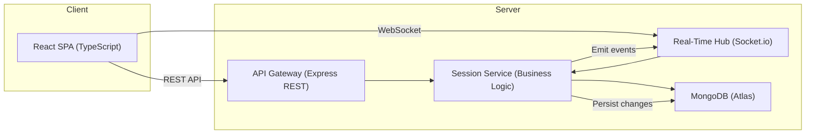

# Architect Mission Report

**Agent**: architect  
**Generated**: 2026-08-09T18:18:53.719Z

---

## Architecture Style

Modular Monolith with real‑time hub

## Components

- **Frontend SPA** (Client Application): Single‑page application built with React and TypeScript. Renders the retro board UI, handles drag‑and‑drop, local state, and communicates with the backend via REST and WebSocket.
- **API Gateway** (REST API): Express server exposing HTTP endpoints for session creation, column/card CRUD, voting and action‑item management. Stateless, performs input validation and forwards business requests to the Session Service.
- **Real‑Time Hub** (WebSocket Server): Socket.io server that maintains persistent connections, broadcasts domain events (card moves, votes, action‑item updates) to all participants, and handles reconnection/resynchronisation.
- **Session Service** (Business Logic Service): Core service that implements all domain rules: session lifecycle, column/card manipulation, grouping, voting limits, action‑item workflow. Persists state to MongoDB and emits events to the Real‑Time Hub.
- **Database** (Data Store): MongoDB Atlas cluster storing sessions, columns, cards, votes, clusters and action items as JSON‑like documents. Provides indexed queries for fast retrieval of a session’s board state.

## Tech Stack

- **Frontend**: React 18 + TypeScript — React has the largest ecosystem, mature drag‑and‑drop libraries (react‑beautiful‑dnd), and excellent TypeScript support, which speeds UI development for non‑technical users. Vue is comparable but the team’s existing expertise is in React; Svelte is newer with less community tooling for complex state sync.
- **Backend Framework**: Node.js 20 + Express — Express is minimal, well‑known, and sufficient for a single service exposing REST and Socket.io endpoints. Fastify offers better performance but adds a learning curve for middleware patterns; NestJS provides a full‑blown modular architecture that is overkill for a v1 monolith.
- **Real‑Time Transport**: Socket.io 4 — Socket.io abstracts browser compatibility, provides automatic reconnection, and supports fallback transports, which simplifies offline‑resilience. Native WebSocket would require custom reconnect logic; Firebase introduces external vendor lock‑in and costs not needed for a simple board.
- **Database**: MongoDB Atlas (cloud) — MongoDB’s document model maps naturally to sessions containing nested columns, cards, votes, and action items, reducing the need for complex joins. PostgreSQL is relational and would need additional tables; DynamoDB is key‑value oriented and would increase schema management effort for nested structures.
- **Containerization**: Docker — Docker guarantees identical dev, test, and production environments and is supported by all chosen PaaS providers. Podman offers similar features but has less CI integration; avoiding containers would make local onboarding harder.
- **Hosting / Infra**: Render.com (Docker service) — Render provides cheap, auto‑scaling Docker deployments with built‑in HTTPS and health checks, fitting the modest traffic expectations. Heroku’s free tier is limited and pricing rises quickly; Railway is comparable but Render’s logs and metrics UI are more straightforward for a small team.
- **CI/CD**: GitHub Actions — The codebase lives in GitHub; Actions integrates natively, offers free minutes for open‑source, and can build Docker images, run tests, and push to Render. GitLab CI would require moving repositories; CircleCI adds external service overhead.
- **Testing**: Jest + React Testing Library for unit, Cypress for end‑to‑end — Jest is the de‑facto standard for JavaScript unit testing with built‑in mocking; React Testing Library encourages testing UI behavior. Cypress provides reliable browser‑level tests for real‑time interactions. Mocha is older and lacks built‑in TypeScript support; Playwright is powerful but Cypress’s UI‑centric workflow matches the SPA nature better.
- **Logging / Observability**: Winston logger with LogDNA (or Render logs) — Winston is simple, supports JSON formatting, and integrates with most Node environments. Render already aggregates container stdout, which can be shipped to LogDNA for searchable logs. Pino is faster but requires additional setup for structured logs; Datadog adds cost and complexity unnecessary for v1.

## Epics

- **EPIC-1** Session Management: Facilitator can create a new retro session, obtain a shareable link, and participants can load the session without authentication. Includes random hard‑to‑guess session IDs and basic session metadata persistence.
- **EPIC-2** Columns & Cards CRUD: Create, rename, add, edit, delete columns and cards. Enforce author‑only edit/delete rights (or facilitator override). Persist changes and broadcast them in real time.
- **EPIC-3** Real‑Time Collaboration: Synchronise all board actions (card moves, votes, action‑item updates) across participants with sub‑second latency. Provide automatic reconnection and state resynchronisation when the connection drops.
- **EPIC-4** Grouping & Voting: Allow participants to drag cards into clusters, assign configurable votes per session, and display live vote counts. Enforce per‑user vote limits.
- **EPIC-5** Action Items Management: Facilitator can turn any card or cluster into an action item with title, description, owner, and optional due date. Action items appear in a persistent list, can be marked done, edited, or reassigned.
- **EPIC-6** Offline Resilience & Sync: Enable the SPA to operate in offline mode using local storage, queueing user actions, and automatically syncing with the server once connectivity is restored, ensuring no data loss.

## Architecture Diagram

