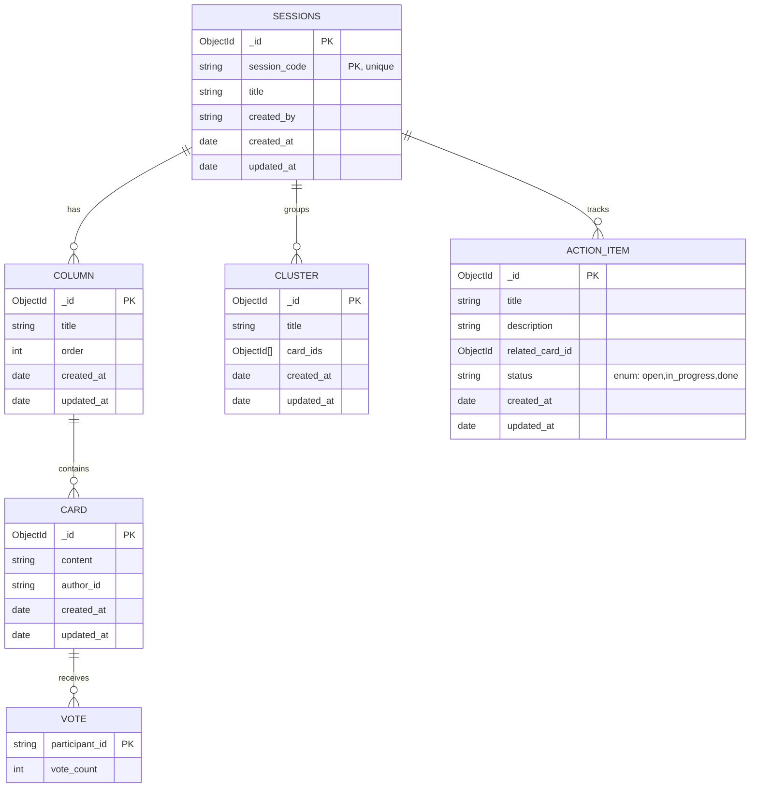

# DBA Mission Report

**Agent**: dba  
**Generated**: 2026-08-09T18:20:11.047Z

---

## Database Engine: MongoDB Atlas

MongoDB’s flexible document model maps directly to the retro board domain where a session contains nested columns, cards, votes, clusters and action items. This eliminates the need for complex joins, enables atomic updates with positional operators, and leverages built‑in sharding and scaling features of Atlas for the required horizontal scalability.

## Entities (6)

- **sessions**: 9 columns
- **Column**: 6 columns
- **Card**: 6 columns
- **Vote**: 2 columns
- **Cluster**: 5 columns
- **ActionItem**: 7 columns

## ERD

